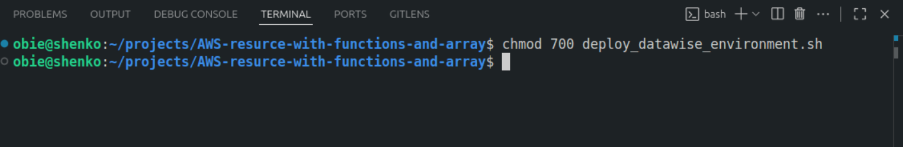
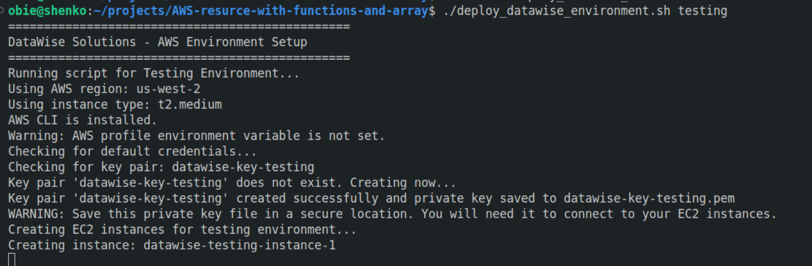
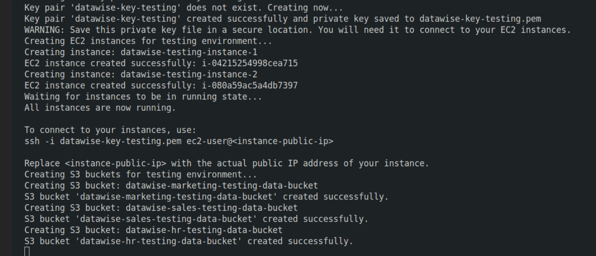
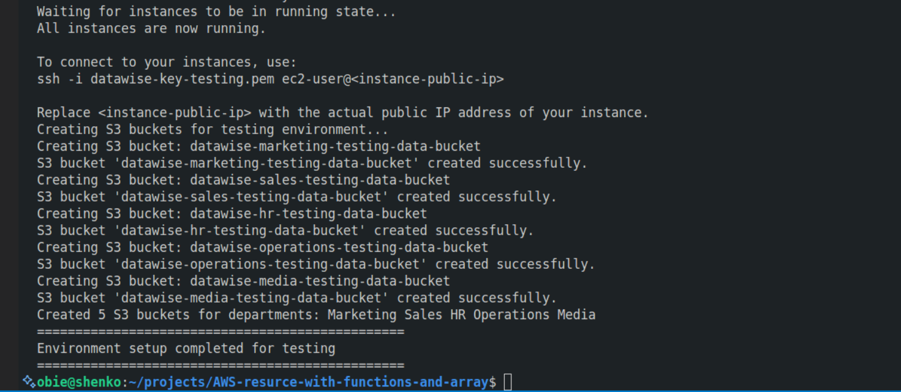

# AWS-resource-with-functions-and-array.
## This project will demonstrate creating AWS resource with script, functions and array.


### We will create two EC2 instance datawise organisation and 5 S3 buckets for HR, Marketing, Sales, Operations amd Media department respectively using a script.
## Prerequisites

1. AWS CLI installed and configured with appropriate permissions.

2. An existing AWS key pair for EC2 instance access.

3. Proper IAM permissions to create EC2 instances and S3 buckets.

### Create instance

* Login to your AWS account, goto EC2 and click 'Create key pair' to create a new and download a new key-pair.

.png)

* create a script file, copy and paste the script below.

```bash
#!/bin/bash

# Environment variable
ENVIRONMENT=$1

# Function to check number of arguments
check_num_of_args() {
    if [ "$#" -ne 1 ]; then
        echo "Usage: $0 <environment>"
        echo "Valid environments: local, testing, production"
        exit 1
    fi
}

# Function to activate infrastructure environment
activate_infra_environment() {
    # Acting based on the argument value
    if [ "$ENVIRONMENT" == "local" ]; then
        echo "Running script for Local Environment..."
        AWS_REGION="us-east-1"
        INSTANCE_TYPE="t2.micro"
    elif [ "$ENVIRONMENT" == "testing" ]; then
        echo "Running script for Testing Environment..."
        AWS_REGION="us-west-2"
        INSTANCE_TYPE="t2.medium"
    elif [ "$ENVIRONMENT" == "production" ]; then
        echo "Running script for Production Environment..."
        AWS_REGION="eu-west-1"
        INSTANCE_TYPE="t2.large"
    else
        echo "Invalid environment specified. Please use 'local', 'testing', or 'production'."
        exit 2
    fi
    
    # Set AWS region
    export AWS_DEFAULT_REGION="$AWS_REGION"
    echo "Using AWS region: $AWS_REGION"
    echo "Using instance type: $INSTANCE_TYPE"
    
    # Set key pair name based on environment
    KEY_PAIR_NAME="datawise-key-$ENVIRONMENT"
}

# Function to check if AWS CLI is installed
check_aws_cli() {
    if ! command -v aws &> /dev/null; then
        echo "AWS CLI is not installed. Please install it before proceeding."
        return 1
    fi
    echo "AWS CLI is installed."
}

# Function to check if AWS profile is set
check_aws_profile() {
    if [ -z "$AWS_PROFILE" ] && [ -z "$AWS_ACCESS_KEY_ID" ]; then
        echo "Warning: AWS profile environment variable is not set."
        echo "Checking for default credentials..."
        
        # Check if we have any AWS credentials configured
        if ! aws sts get-caller-identity &> /dev/null; then
            echo "Error: No AWS credentials found. Please configure AWS CLI or set AWS environment variables."
            return 1
        fi
    else
        echo "AWS credentials are configured."
    fi
}

# Function to create or validate key pair
setup_key_pair() {
    echo "Checking for key pair: $KEY_PAIR_NAME"
    
    # Check if key pair already exists
    if aws ec2 describe-key-pairs --key-names "$KEY_PAIR_NAME" &> /dev/null; then
        echo "Key pair '$KEY_PAIR_NAME' already exists."
        return 0
    fi
    
    echo "Key pair '$KEY_PAIR_NAME' does not exist. Creating now..."
    
    # Create the key pair
    if aws ec2 create-key-pair \
        --key-name "$KEY_PAIR_NAME" \
        --key-type rsa \
        --key-format pem \
        --query 'KeyMaterial' \
        --output text > "${KEY_PAIR_NAME}.pem"; then
        
        chmod 400 "${KEY_PAIR_NAME}.pem"
        echo "Key pair '$KEY_PAIR_NAME' created successfully and private key saved to ${KEY_PAIR_NAME}.pem"
        echo "WARNING: Save this private key file in a secure location. You will need it to connect to your EC2 instances."
        return 0
    else
        echo "Failed to create key pair '$KEY_PAIR_NAME'."
        return 1
    fi
}

# Function to create EC2 Instances
create_ec2_instances() {
    echo "Creating EC2 instances for $ENVIRONMENT environment..."
    
    # Specify the parameters for the EC2 instances
    local ami_id=""
    local count=2  # Number of instances to create
    
    # Set AMI based on region
    case "$AWS_REGION" in
        "us-east-1")
            ami_id="ami-0c02fb55956c7d316"  # Amazon Linux 2 in us-east-1
            ;;
        "us-west-2")
            ami_id="ami-0d70546e43a941d70"  # Amazon Linux 2 in us-west-2
            ;;
        "eu-west-1")
            ami_id="ami-0c1c30571d49d6c59"  # Amazon Linux 2 in eu-west-1
            ;;
        *)
            echo "Unsupported region: $AWS_REGION"
            return 1
            ;;
    esac
    
    # Array to store created instance IDs
    local instance_ids=()
    
    # Create the EC2 instances
    for ((i=1; i<=$count; i++)); do
        local instance_name="datawise-$ENVIRONMENT-instance-$i"
        
        echo "Creating instance: $instance_name"
        
        # Create the instance
        local instance_id=$(aws ec2 run-instances \
            --image-id "$ami_id" \
            --instance-type "$INSTANCE_TYPE" \
            --key-name "$KEY_PAIR_NAME" \
            --count 1 \
            --tag-specifications "ResourceType=instance,Tags=[{Key=Name,Value=$instance_name},{Key=Environment,Value=$ENVIRONMENT},{Key=Project,Value=DataWise}]" \
            --query 'Instances[0].InstanceId' \
            --output text)
        
        if [ $? -eq 0 ] && [ -n "$instance_id" ]; then
            echo "EC2 instance created successfully: $instance_id"
            instance_ids+=("$instance_id")
        else
            echo "Failed to create EC2 instance: $instance_name"
            return 1
        fi
    done
    
    # Wait for instances to be running
    if [ ${#instance_ids[@]} -gt 0 ]; then
        echo "Waiting for instances to be in running state..."
        aws ec2 wait instance-running --instance-ids "${instance_ids[@]}"
        echo "All instances are now running."
        
        # Display connection information
        echo ""
        echo "To connect to your instances, use:"
        echo "ssh -i ${KEY_PAIR_NAME}.pem ec2-user@<instance-public-ip>"
        echo ""
        echo "Replace <instance-public-ip> with the actual public IP address of your instance."
    fi
    
    return 0
}

# Function to create S3 buckets for different departments
create_s3_buckets() {
    echo "Creating S3 buckets for $ENVIRONMENT environment..."
    
    # Define a company name as prefix
    company="datawise"
    
    # Array of department names
    departments=("Marketing" "Sales" "HR" "Operations" "Media")
    
    # Array to track created buckets
    local bucket_names=()
    
    # Loop through the array and create S3 buckets for each department
    for department in "${departments[@]}"; do
        # Construct bucket name with environment suffix
        bucket_name="${company}-${department}-${ENVIRONMENT}-data-bucket"
        
        # Ensure bucket name is lowercase and valid
        bucket_name=$(echo "$bucket_name" | tr '[:upper:]' '[:lower:]')
        
        echo "Creating S3 bucket: $bucket_name"
        
        # Create S3 bucket using AWS CLI
        if [ "$AWS_REGION" == "us-east-1" ]; then
            aws s3api create-bucket \
                --bucket "$bucket_name" \
                --region "$AWS_REGION" > /dev/null 2>&1
        else
            aws s3api create-bucket \
                --bucket "$bucket_name" \
                --region "$AWS_REGION" \
                --create-bucket-configuration LocationConstraint="$AWS_REGION" > /dev/null 2>&1
        fi
        
        if [ $? -eq 0 ]; then
            echo "S3 bucket '$bucket_name' created successfully."
            
            # Add tags to the bucket
            aws s3api put-bucket-tagging \
                --bucket "$bucket_name" \
                --tagging "TagSet=[{Key=Department,Value=$department},{Key=Environment,Value=$ENVIRONMENT},{Key=Project,Value=DataWise}]" > /dev/null 2>&1
            
            # Create folder structure for the department
            aws s3api put-object \
                --bucket "$bucket_name" \
                --key "raw/" > /dev/null 2>&1
                
            aws s3api put-object \
                --bucket "$bucket_name" \
                --key "processed/" > /dev/null 2>&1
                
            aws s3api put-object \
                --bucket "$bucket_name" \
                --key "analysis/" > /dev/null 2>&1
                
            bucket_names+=("$bucket_name")
        else
            echo "Failed to create S3 bucket '$bucket_name'. It might already exist."
        fi
    done
    
    echo "Created ${#bucket_names[@]} S3 buckets for departments: ${departments[*]}"
}

# Main execution flow
echo "================================================"
echo "DataWise Solutions - AWS Environment Setup"
echo "================================================"

# Check number of arguments
check_num_of_args "$@"

# Activate the appropriate environment
activate_infra_environment

# Check AWS CLI installation
if ! check_aws_cli; then
    exit 1
fi

# Check AWS profile/credentials
if ! check_aws_profile; then
    exit 1
fi

# Setup key pair (create if doesn't exist)
if ! setup_key_pair; then
    echo "Error setting up key pair. Exiting."
    exit 1
fi

# Create EC2 instances
if ! create_ec2_instances; then
    echo "Error creating EC2 instances. Exiting."
    exit 1
fi

# Create S3 buckets
if ! create_s3_buckets; then
    echo "Error creating S3 buckets. Exiting."
    exit 1
fi

echo "================================================"
echo "Environment setup completed for $ENVIRONMENT"
echo "================================================"
```
## Key Features of This Script
1. __Environment-based Configuration:__ Different settings for local, testing, and production environments

2. __Array Usage:__

    * Department names stored in an array for S3 bucket creation

    * Instance IDs stored in an array for tracking

3. __Error Handling:__

   * Checks for AWS CLI installation

   * Validates AWS credentials

   * Handles AWS command failures gracefully

4. __AWS Resource Tagging:__ All resources are tagged with environment and project information

5. __S3 Bucket Organization:__ Creates standardized folder structure in each department bucket

6. __Input Validation:__ Checks for correct number of arguments and valid environment values.

* Change permissions on the script file run `chmod 700 deploy_environment.sh`



* To run the script `deploy_datawise_environment.sh testing`

#### While testing is the environment variable passed to the script. You could also pass, deployment or production.



* As you can see the script is running.



* Script executed successfully as shown below.



## Summary

### Through this project, I have gained comprehensive experience in developing automated AWS infrastructure deployment scripts using shell scripting. I learned to implement critical scripting concepts including functions for modularizing tasks like EC2 instance and S3 bucket creation, arrays for managing resource tracking across multiple departments, environment variables for secure credential management, command-line arguments for dynamic configuration, and robust error handling to ensure graceful failure recovery. The project taught me practical AWS CLI operations, proper resource tagging strategies, cross-environment configuration patterns, and security best practices for key pair management. Most importantly, I developed an understanding of how to create production-ready infrastructure automation scripts that balance flexibility, security, and reliability while following AWS best practices for resource organization and access control.

